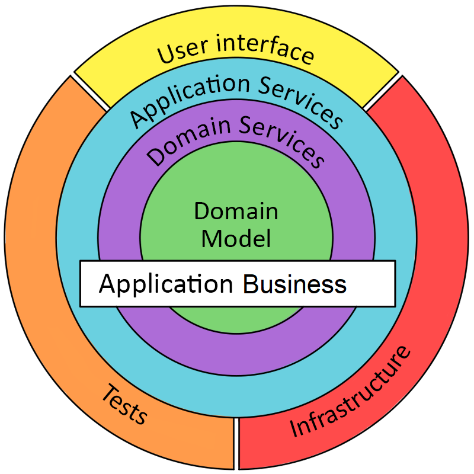

# Stefanini Registration API - TEST
.NET Core Web Api to test devs knowledge 😉   (don't worry, it's fun!)
This project uses .NET Core 6.  
Entity Framework & SQLite. And some cool stuff (Fluent Validation, AutoMapper, XUnit etc!)

# MIGRATION COMMANDS
Use the Package Manager Console to execute:  
`Add-Migration Initial` to create a migration.  
`Update-Database` to update the database.  

# PROJECT CONCEPT
Use the existent structure to create the following:  
<ul>
  <li>Endpoints to manage <strong>Events.</strong> (C.R.U.D)</li>
  <li>Endpoints to manage <strong>Registrations.</strong> (C.R.U.D)</li>
  <li>Additional challenge, create unit tests for it!</li>
</ul>

  

    <strong>Important!</strong>
    The registration needs to be modified! 
    It will have an relationship with Event, so - Configuration, Migration, etc. 
  

# PROJECT STRUCTURE

